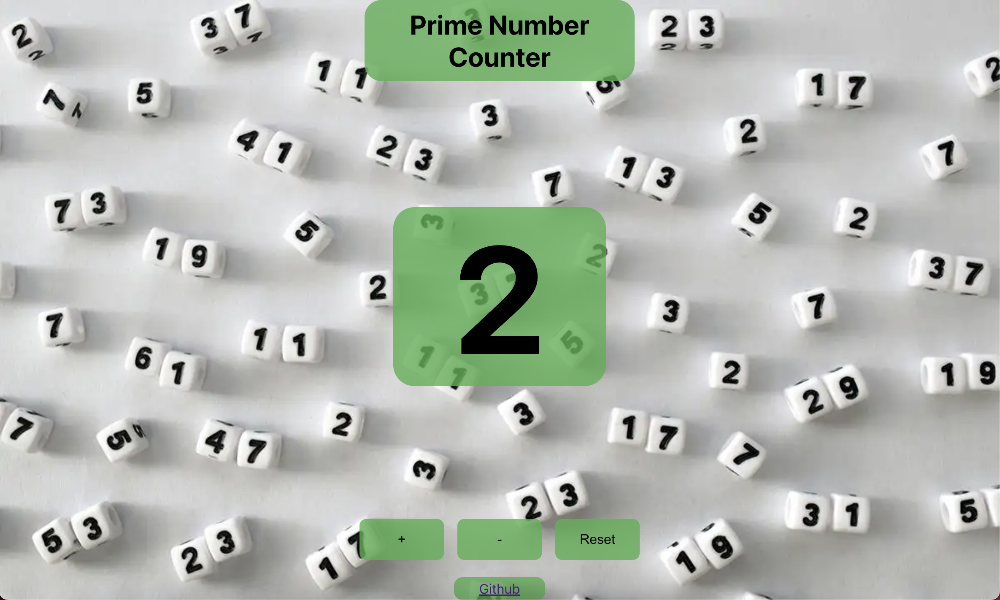

# Counter App with React

Developed a React application for learning how to properly implement useState.  Played around with some JS to allow the counter to increment in prime numbers.

## Website
[Click here to view the site!](https://prime-number-counter-c11.web.app/)

 

## Features 
* useState()
* Prime Number Generation